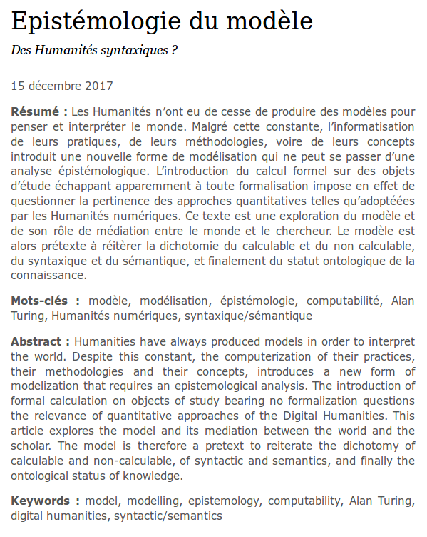

### (#L1) En tant que lecteur, je veux pouvoir afficher un article

une page article présente :

_élément_  | _proto_  | _v1_  | _v2_  
--|---|---|---|
mot-clés éditeur clicables | X  | X  | X  
titre, auteur, résumé(s) + mot-clés auteur clicables |  X | X  | X  
corps de l'article  | X  | X  | X  
annotations hypothesis (voir [scénario #L2](./L2.md)) | X  | X  | X
encart annotations (voir [scénario #L2](./L2.md)) |   | X  | X  
conversations liées  |   | X  | X

#### Précision sur les mot-clés
D'un point de vue éditorial, les mot-clés éditeurs sont utilisés par l'éditeur pour _catégoriser_ l'article parmi le corpus d'article, tandis que les mot-clé auteurs sont utilisés par l'auteur pour _caractériser_ l'article. Il est donc important que l'affichage d'un article présente les mot-clés auteurs tels que l'auteur les a renseignés.

On retrouvera donc une présentation équivalente (en données, pas en mise en forme) à ce que peut proposer le site Sens Public aujourd'hui :

Il est donc nécessaire de conserver les mot-clés auteur dont la chaine de caractère pourrait être équivalente à celle d'un mot-clé éditeur.
